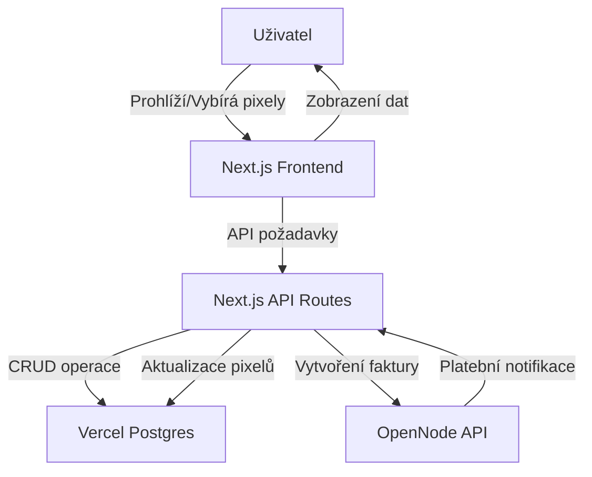
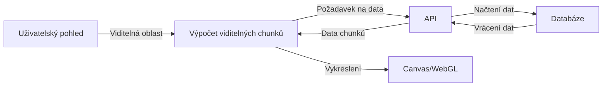

# Detailní plán implementace projektu "1 BTC Pixel Grid"

## Přehled projektu

Vytvoříme webovou aplikaci, kde:
- 100 000 000 pixelů = 1 Bitcoin (každý pixel = 1 satoshi)
- Uživatelé mohou nakupovat pixely přes Lightning Network
- Každý pixel může mít vlastní barvu a URL odkaz
- Aplikace bude zobrazovat statistiky o prodaných pixelech

## Technický stack

- **Frontend + Backend**: Next.js (monolitická aplikace)
- **Databáze**: Vercel Postgres
- **Platební systém**: OpenNode API pro Lightning Network platby
- **Hosting**: Vercel (free tier)
- **Verzování**: GitHub

## Architektura aplikace



## Datový model

### Tabulka `pixels`

```sql
CREATE TABLE pixels (
    id SERIAL PRIMARY KEY,
    x INTEGER NOT NULL,
    y INTEGER NOT NULL,
    color VARCHAR(7) NOT NULL,
    url TEXT,
    message TEXT,
    owner_id TEXT,
    purchase_date TIMESTAMP WITH TIME ZONE DEFAULT CURRENT_TIMESTAMP,
    invoice_id TEXT,
    UNIQUE(x, y)
);
```

### Tabulka `transactions`

```sql
CREATE TABLE transactions (
    id SERIAL PRIMARY KEY,
    invoice_id TEXT NOT NULL,
    amount INTEGER NOT NULL,
    status TEXT NOT NULL,
    created_at TIMESTAMP WITH TIME ZONE DEFAULT CURRENT_TIMESTAMP,
    completed_at TIMESTAMP WITH TIME ZONE,
    pixel_count INTEGER NOT NULL
);
```

### Tabulka `statistics`

```sql
CREATE TABLE statistics (
    id SERIAL PRIMARY KEY,
    total_pixels_sold INTEGER NOT NULL DEFAULT 0,
    total_satoshis_collected INTEGER NOT NULL DEFAULT 0,
    last_updated TIMESTAMP WITH TIME ZONE DEFAULT CURRENT_TIMESTAMP
);
```

## Implementační plán

### 1. Nastavení projektu

1. Inicializace Next.js projektu
2. Konfigurace Vercel Postgres
3. Nastavení GitHub repozitáře
4. Konfigurace OpenNode API klíčů

### 2. Backend implementace

#### API Endpointy

1. **GET /api/pixels** - Získání dat o pixelech (s možností filtrování)
2. **POST /api/pixels/select** - Výběr pixelů pro nákup
3. **POST /api/payment/create** - Vytvoření Lightning Network faktury
4. **GET /api/payment/status/:invoiceId** - Kontrola stavu platby
5. **POST /api/payment/webhook** - Webhook pro OpenNode notifikace
6. **GET /api/statistics** - Získání statistik o prodaných pixelech

#### Databázové operace

1. Vytvoření tabulek v Vercel Postgres
2. Implementace CRUD operací pro pixely
3. Implementace transakcí a statistik

#### Integrace s OpenNode

1. Vytvoření Lightning Network faktur
2. Zpracování platebních notifikací
3. Aktualizace stavu pixelů po úspěšné platbě

### 3. Frontend implementace

#### Komponenty

1. **PixelGrid** - Interaktivní canvas pro zobrazení a interakci s pixely
2. **ControlPanel** - Ovládací prvky pro zoom, výběr barvy, atd.
3. **SelectionInfo** - Informace o vybraných pixelech
4. **PaymentModal** - Modální okno pro platbu s QR kódem
5. **Statistics** - Zobrazení statistik o prodaných pixelech

#### Stránky

1. **Home (/)** - Hlavní stránka s pixel gridem
2. **About (/about)** - Informace o projektu
3. **FAQ (/faq)** - Často kladené otázky

#### Funkce

1. Vykreslování pixel gridu s efektivním načítáním dat
2. Zoom a navigace v gridu
3. Výběr a nákup pixelů
4. Zpracování Lightning Network plateb
5. Zobrazení statistik

### 4. Optimalizace výkonu

1. Implementace virtualizace pro efektivní vykreslování velkého množství pixelů
2. Chunking dat pro postupné načítání pixelů
3. Cachování dat na straně klienta
4. Optimalizace databázových dotazů

### 5. Testování

1. Unit testy pro API endpointy
2. Integrační testy pro platební systém
3. End-to-end testy pro uživatelské scénáře
4. Testování výkonu a škálovatelnosti

### 6. Nasazení

1. Nastavení Vercel projektu
2. Konfigurace prostředí (environment variables)
3. Nastavení domény
4. Monitoring a analýza

## Časový harmonogram

1. **Týden 1**: Nastavení projektu, databáze a základní struktura
2. **Týden 2**: Implementace backend API a integrace s OpenNode
3. **Týden 3**: Implementace frontend komponent a interaktivního gridu
4. **Týden 4**: Testování, optimalizace a nasazení

## Technické výzvy a řešení

### Výzva 1: Efektivní vykreslování 10 000 x 10 000 pixelů

**Řešení**: 
- Implementace virtualizace - vykreslování pouze viditelných pixelů
- Chunking dat - načítání dat po částech podle aktuálního pohledu
- Využití WebGL pro vykreslování velkého množství pixelů



### Výzva 2: Zpracování souběžných plateb

**Řešení**:
- Implementace zamykání vybraných pixelů během platebního procesu
- Timeout pro rezervace pixelů
- Transakční zpracování aktualizací v databázi

### Výzva 3: Optimalizace databáze pro velké množství pixelů

**Řešení**:
- Indexování podle souřadnic
- Ukládání dat v chunkcích pro efektivnější dotazy
- Cachování často používaných dat

## Budoucí rozšíření

1. **Historie změn** - Sledování historie vlastnictví pixelů
2. **Exportování obrázků** - Možnost exportovat části gridu jako obrázky
3. **API pro vývojáře** - Veřejné API pro integraci s jinými aplikacemi
4. **Sociální funkce** - Sdílení vytvořených obrázků na sociálních sítích